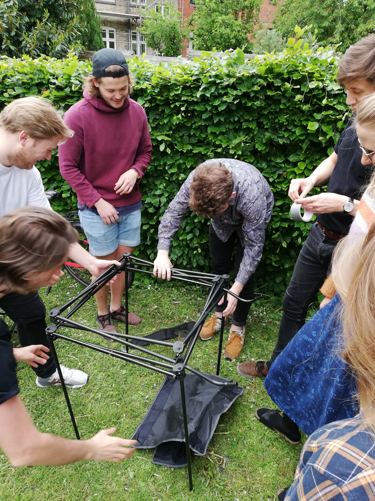
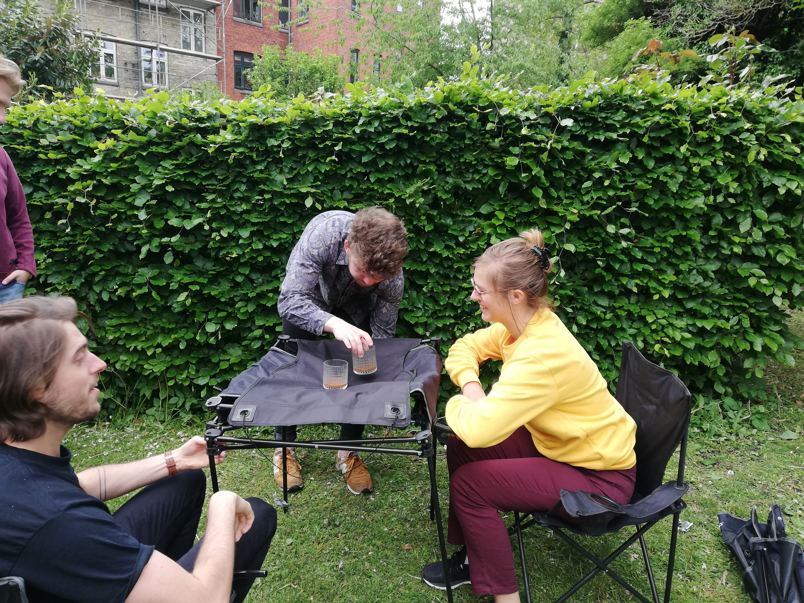

Hvis du har mindst to stole, kan du bygge et lækkert bord til makrel-madderne.

Fjern stoffet fra de ødelagte stole og kør tværstiverne helt op til "toppen" af stolene. Disse kan nu holdes sammen med reb, som du kan få i Camp Kolonihaven. 

De gamle polstringer fra stole kan nu spændes hen over rammen for et forholdsvist stabil bord.

Selvom der er gaffa-tape på vores gamle prototype-billeder, er vi gået helt væk fra tape og plastik-produkter og bruger nu kun naturprodukter.